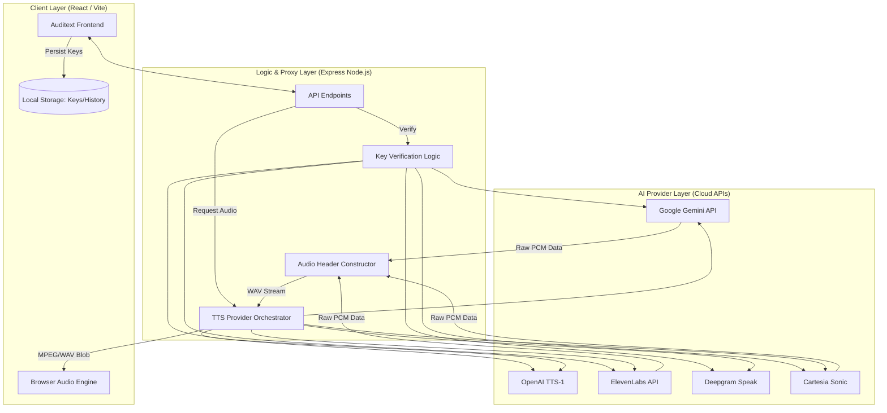
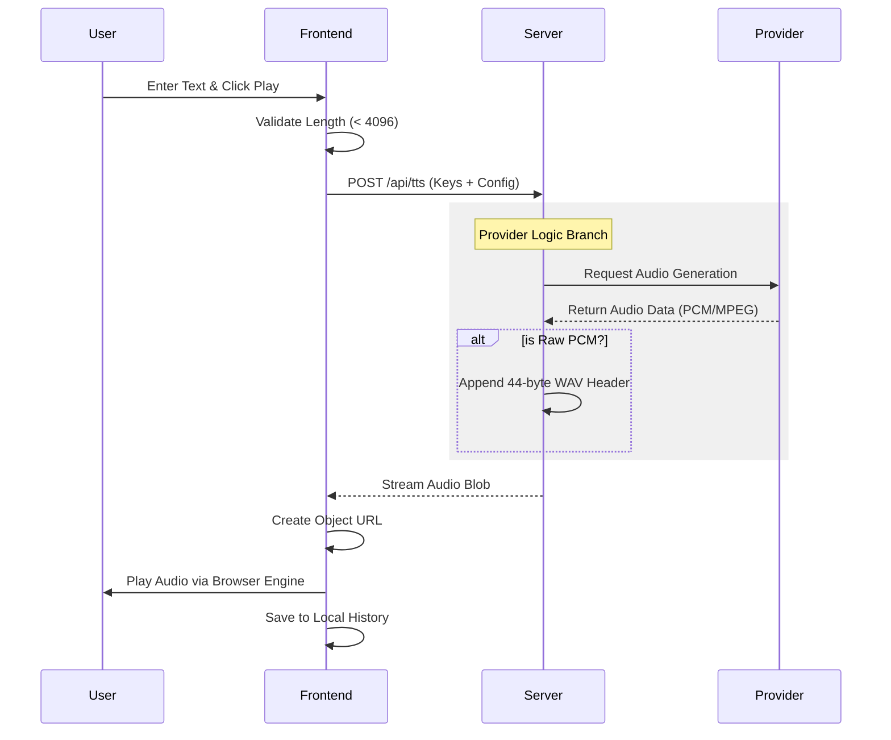
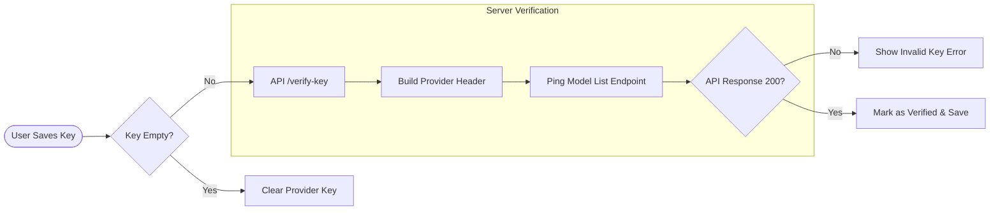

# 🎙️ Auditext: Advanced Multi-Provider TTS Studio

[](https://opensource.org/licenses/MIT)
[]()
[](mailto:rehan515ahmad@gmail.com)
[]()
[]()

Auditext is a professional-grade Text-to-Speech (TTS) studio that bridges the gap between various industry-leading AI voice providers into a single, unified interface. It empowers creators to synthesize high-fidelity audio using models from Google Gemini, OpenAI, ElevenLabs, Deepgram, and Cartesia.

### 4. Google Authentication & Cloud Sync
Auditext supports Google Authentication to provide a seamless cross-device experience.
- **Profile Persistence:** Your user profile is synced to Firestore.
- **History Sync:** Your generation history is stored securely in your private Firestore collection, allowing you to access your previous work from any authenticated session.
- **Privacy First:** We only store your public profile info and the session history you explicitly generate. Your API keys remain strictly local to your browser.

---

## 🏗️ System Architecture

Auditext follows a modern full-stack architecture designed for high-performance audio streaming and secure API orchestration.



---

## 🧠 Core Concepts

### 1. Provider Abstraction Layer
Auditext abstracts the complex differences between various TTS providers (OpenAI, ElevenLabs, etc.) into a unified set of voice profiles. While OpenAI uses `nova`, `alloy`, and `shimmer`, Gemini uses `Kore` and `Zephyr`. Auditext's backend handles this mapping transparently, allowing the user to switch providers without losing their voice selection context.

### 2. Audio Header Reconstruction (PCM to WAV)
Most high-performance TTS APIs (like Cartesia or ElevenLabs) return **Raw PCM data** to reduce latency. Raw PCM cannot be played directly by most modern browsers. 
Auditext implements a **RIFF/WAV Header Constructor** on the server. Whenever raw audio is received, the server calculates:
- Sample Rate (e.g., 16000Hz or 24000Hz)
- Bit Depth (16-bit)
- Channel Count (Mono)
It then prepends the 44-byte WAV header dynamically before streaming it back to the frontend.

### 3. Secure Client-Side Key Management
Auditext utilizes a "Bring Your Own Key" (BYOK) model. To ensure security:
- Keys are never stored on the app's database.
- They are stored in the user's browser via **encrypted LocalStorage**.
- Keys are only sent to the server over HTTPS during active requests and are held only in volatile memory during the transaction.

---

## 🔄 Business Logic Flows

### TTS Request Lifecycle
This flowchart details how a single "Speak" action travels through the system.



### Provider Verification Flow
Auditext ensures that API keys are valid before attempting expensive generation requests.



---

## ✨ Key Features in Detail

| Feature | Description |
| :--- | :--- |
| **Emotion Morphing** | Maps high-level emotions (Happy, Angry, Whispering) to specific system instructions or provider-specific parameters. |
| **Waveform Visualization** | A real-time CSS-animated waveform synced with the playing state of the audio engine. |
| **Session Persistence** | Automatic saving of your last 10 generations, including the text and specific settings used. |
| **Provider Hot-Swapping** | Change the underlying AI engine (e.g., from Gemini to ElevenLabs) with a single click. |
| **Intelligent Speed Scaling** | Adjust playback rate (0.5x to 2.0x) on the fly without re-generating audio. |

---

## 🛠️ Technology Stack

- **Frontend:** React 19, Vite, Tailwind CSS 4.0, Motion (React Animation)
- **Backend:** Node.js, Express
- **Icons:** Lucide React
- **Theming:** Shadcn/UI (Adapted components), Next-Themes (Dark/Light Mode)
- **Visualization:** CSS Custom Properties + Mermaid.js (Architecture)

---

## 🚀 Getting Started

### 1. Installation
```bash
npm install
```

### 2. Environment Configuration
Create a `.env` file in the root:
```env
GEMINI_API_KEY=your_default_key_here
```

### 3. Running Development
```bash
npm run dev
```

### 4. Build for Production
```bash
npm run build
npm start
```

---

## 📜 Core Concept Deep Dive: Emotion System Prompts

Auditext uses a structured **Prompt Engineering System** for providers that don't native support "emotions" (like Gemini). When you select "Whispering", Auditext sends the following hidden instruction:

> *"You are a professional voice actor. Read the text very softly and intimately, as if whispering a secret close to someone's ear — hushed, slow, private."*

This ensures consistent emotional output across different models that might not have built-in "emotion" tags.

---

## 📄 License

This project is licensed under the **MIT License**.

Copyright © 2026 **Rehan Ahmad**.
See the [LICENSE](./LICENSE) file for details.

