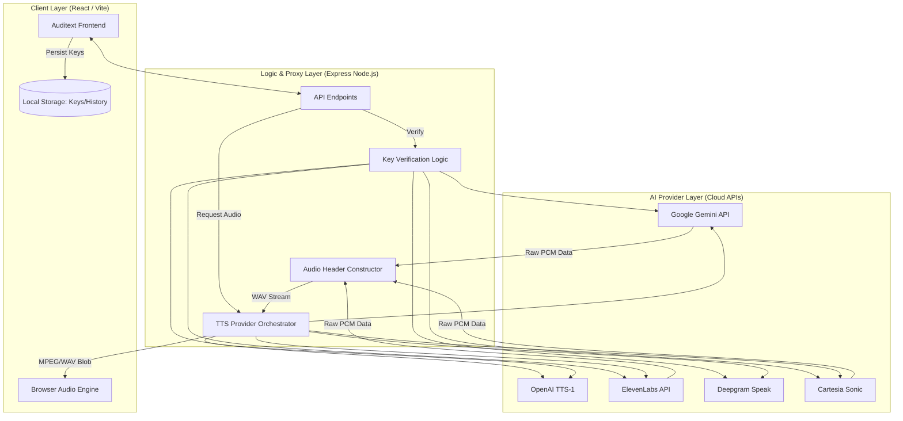
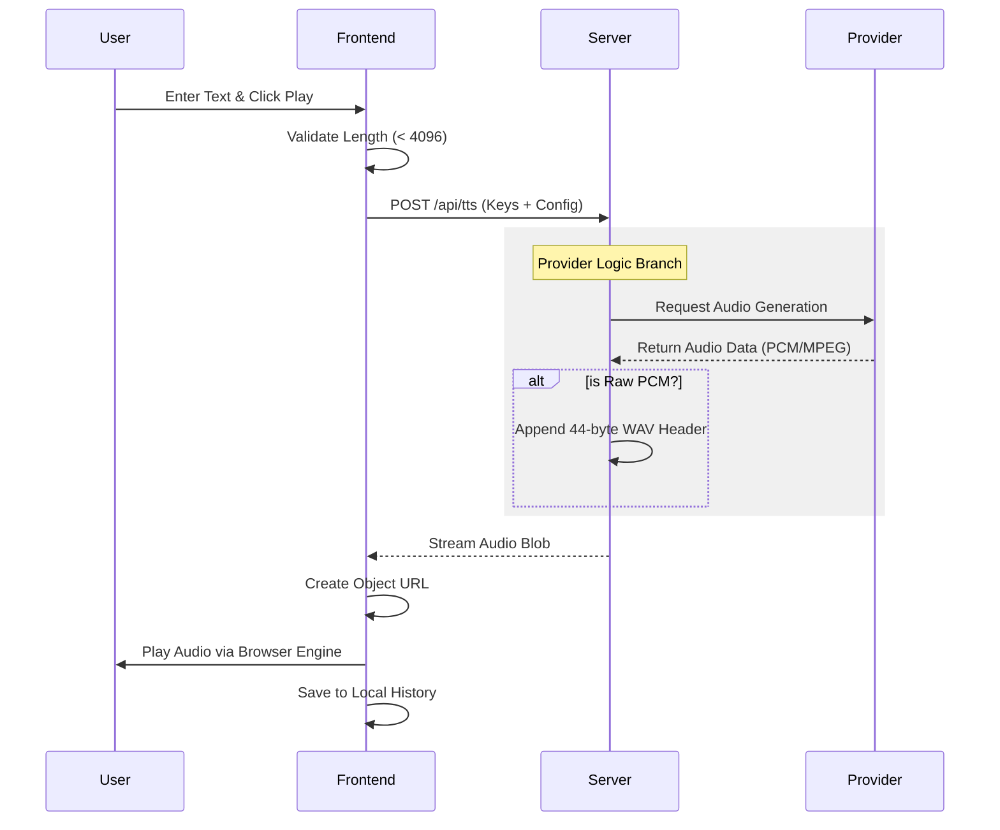

# 🎙️ Auditext: Advanced Multi-Provider TTS Studio

[](https://opensource.org/licenses/MIT) []() [](mailto:rehan515ahmad@gmail.com) []() []()

Auditext is a professional-grade Text-to-Speech (TTS) studio that bridges the gap between various industry-leading AI voice providers into a single, unified interface. It empowers creators to synthesize high-fidelity audio using models from Google Gemini, OpenAI, ElevenLabs, Deepgram, and Cartesia.

## 🔑 Authentication & Cloud Sync

Auditext supports Google Authentication to provide a seamless cross-device experience:

*   **Profile Persistence:** Your user profile is synced securely to Firestore.
*   **History Sync:** Generation history is stored securely in your private Firestore collection, allowing access to previous work from any authenticated session.
*   **Privacy First:** We exclusively store your public profile info and the session history you explicitly generate. Your sensitive API keys remain stored locally in your browser.

---

## 🏗️ System Architecture

Auditext follows a modern full-stack architecture designed for high-performance audio streaming and secure API orchestration.



---

## 🧠 Core Concepts

### 1. Provider Abstraction Layer
Auditext abstracts complex differences between various TTS providers (OpenAI, ElevenLabs, etc.) into a unified set of voice profiles. Auditext's backend handles mapping transparently, allowing the user to switch providers without losing their voice selection context.

### 2. Audio Header Reconstruction (PCM to WAV)
Most high-performance TTS APIs return **Raw PCM data** to reduce latency. Auditext implements a **RIFF/WAV Header Constructor** on the server. Whenever raw audio is received, the server calculates:
*   Sample Rate (e.g., 16000Hz or 24000Hz)
*   Bit Depth (16-bit)
*   Channel Count (Mono)
It then dynamically prepends the 44-byte WAV header before streaming it back to the frontend.

### 3. Secure Client-Side Key Management
Auditext utilizes a "Bring Your Own Key" (BYOK) model for security:
*   Keys are never stored on our database.
*   Keys are stored in the user's browser via encrypted LocalStorage.
*   Keys are sent to the server over HTTPS during active requests only and are held in volatile memory.

---

## 🔄 Business Logic Flows

### TTS Request Lifecycle
This flowchart traces a "Speak" action through the system.



---

## 🛠️ Technology Stack

*   **Frontend:** React, Vite, Tailwind CSS, Motion (React Animation)
*   **Backend:** Node.js, Express
*   **Database & Auth:** Google Firebase (Firestore & Auth)
*   **Icons:** Lucide React
*   **Theming:** Shadcn/UI (Adapted components), Next-Themes (Dark/Light Mode)

---

## 🚀 Getting Started

### Prerequisites
1. Ensure your `.env` file is configured with the necessary API keys (`GEMINI_API_KEY`, etc.).
2. A Firebase project must be set up for Authentication and Firestore.

### Installation
```bash
npm install
```

### Environment Configuration
Create a `.env` file in the root directory:
```env
GEMINI_API_KEY=your_key_here
```

### Running Development
```bash
npm run dev
```

### Production Build
```bash
npm run build
npm start
```

---

## 📄 License
This project is licensed under the **MIT License**.
Copyright © 2026 **Rehan Ahmad**.
See the [LICENSE](./LICENSE) file for details.

